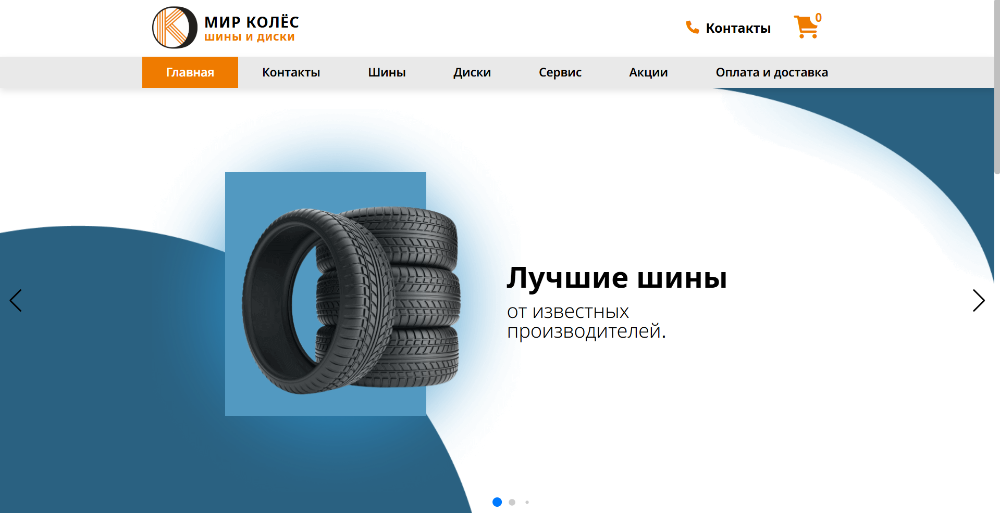
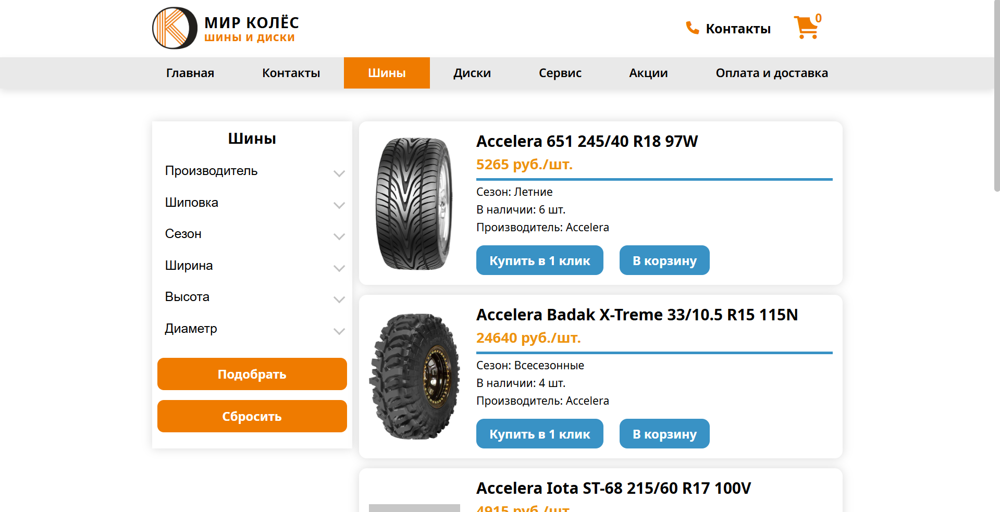

# Mir Wheels

Commercial website for a tire and wheel disk store – online catalog with cart and checkout, promotions page, tire-fitting service booking, and an admin panel for keeping the catalog up to date. Built as a team project (3 people).

**Live:** [mir-wheels.ru](https://mir-wheels.ru)





## Tech Stack

- HTML, SCSS (compiled with Prepros), vanilla JavaScript
- PHP (form mailing, catalog data conversion, admin panel backend)
- Swiper, Yandex Maps API, Google reCAPTCHA

## My Role

Design and full markup, plus all client-side logic:

- Shopping cart and checkout, with order details sent to the company's email via a small PHP mailer
- Swiper slider
- Yandex Maps integration on the contacts page
- Catalog pagination on the tires/disks pages
- Google reCAPTCHA on the order and callback forms
- Tire-fitting service booking form, also sent by email
- Admin panel: upload current tires/disks CSV files to refresh the catalog (converted to JSON that the catalog pages fetch and render) and edit promotions on the sales page

The PHP script that converts the uploaded catalog data to JSON was written by my teammate; the rest of the backend/frontend integration around it (upload UI, admin auth, rendering) is mine.

## Features

- Product catalog (tires, disks) with pagination, sorting and filtering
- Shopping cart with quantity controls and client-side data persistence
- Checkout form with validation and reCAPTCHA, delivered by email
- Service booking form for tire fitting
- Promotions page with content editable from the admin panel
- Contacts page with an interactive Yandex map
- Admin panel with login, CSV catalog upload, and promotions editor

## Project Structure

```
├── api/            # catalog data as JSON, consumed by the catalog pages
├── css/, src/scss/ # styles (SCSS source, compiled CSS)
├── js/             # page scripts: cart, forms, header, sliders, admin panel
├── pages/          # per-catalog (tires/disks) pagination, sorting, cart scripts
├── php/
│   ├── converter/  # CSV/XML -> JSON conversion for the catalog (teammate)
│   ├── shopping-cart/, service/  # order & booking email senders
│   └── adminData.php, sales.php  # admin panel & promotions backend
├── images/, icons/, fonts/, fonts-icon/
└── index.html, tires.html, disks.html, sales.html,
    services.html, delivery.html, contacts.html
```

## License

Private/commercial project – for portfolio reference only.
